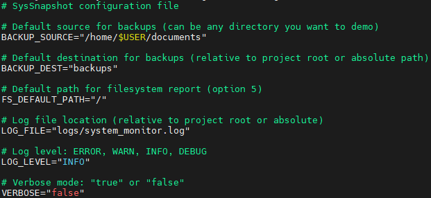
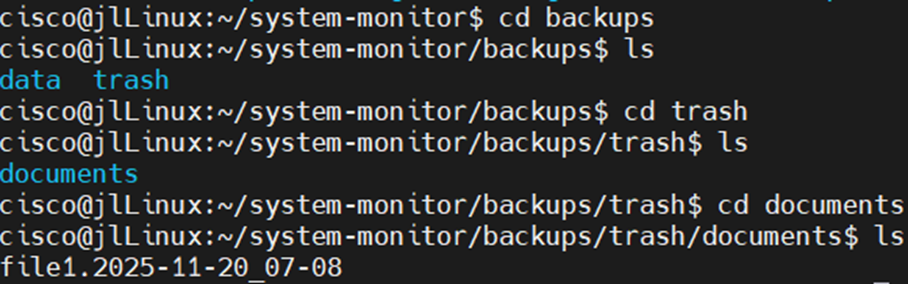

# System Monitor  
A modular Bash-based Linux system monitoring & backup utility.


System Monitor provides real-time system metrics, user activity tracking, incremental backups, trash-based file retention, backup verification, filesystem usage reporting, and process analysis. 

---

## 📁 Project Structure

```
system-monitor/
├── monitor.sh
├── config/
│   └── settings.conf
├── lib/
│   ├── ui.sh
│   ├── logging.sh
│   ├── resources.sh
│   ├── users.sh
│   ├── backup.sh
│   ├── filesystem.sh
│   └── process.sh
├── backups/
│   ├── data/
│   └── trash/
├── logs/
├── reports/
└── screenshots/
```

---

## Installation

### 1. Clone the project

```bash
git clone https://github.com/oligokz/system-monitor.git
cd system-monitor
```

### 2. Make the main script executable

```bash
chmod +x monitor.sh
```

### 3. Install dependencies

```bash
sudo apt install rsync procps coreutils
```

---

## 📦 Dependencies

| Dependency | Purpose |
|-----------|---------|
| **bash (5+)** | Script execution |
| **rsync** | Incremental backup engine |
| **procps** | Provides `ps`, `free`, `uptime` |
| **coreutils** | Provides `df`, `du`, `sort`, `find` |
| **awk / grep** | Parsing & filtering |

Most Linux distributions already include these packages.

---

## ⚙ Settings Configuration

Configuration file:

```
config/settings.conf
```

Example:

```ini
BACKUP_SOURCE="/home"
BACKUP_DEST="backups/data"
FS_DEFAULT_PATH="/"
LOG_FILE="logs/system_monitor.log"
LOG_LEVEL="INFO"
VERBOSE="false"
```



---

## 🧩 Module Overview

### `ui.sh`
Handles UI box drawing, colours, and layout formatting.

### `logging.sh`
Controls log writing, timestamps, and VERBOSE mode.

### `resources.sh`
Displays CPU %, RAM %, uptime, load averages, and swap usage.

### `users.sh`
Shows current user sessions and last login records.

### `backup.sh`
- Incremental backups (`rsync`)  
- Trash retention for deleted files  
- Automatic directory creation  
- Backup verification logic

### `filesystem.sh`
Generates directory size reports using `du -sh`.

### `process.sh`
Shows:
- Top CPU processes  
- Top memory processes  
- Long-running processes (ETIME)

---

# 🌟 Features

---

## 1️⃣ System Resource Monitoring  
Real-time CPU, RAM, load averages, uptime, and swap.


---

## 2️⃣ User Activity Monitoring  
Displays logged-in users and multi-session usage.


---

## 3️⃣ Incremental Backup with Trash System  
Timestamped backups using `rsync`.

### Backup Start  


### Backup Success  


### Deleted File → Trash  


---

## 4️⃣ Backup Integrity Verification  
Compares source + backup file-by-file.


---

## 5️⃣ Filesystem Usage Report  
Analyses directory sizes recursively.


---

## 6️⃣ Process Analysis  
Displays CPU-heavy, memory-heavy, and long-running processes.


---

# ▶ Usage Examples

---

### 🔹 Launch System Monitor

```
./monitor.sh
```

You will see the main menu.

---

### 🔹 Create a Backup

1. Choose **3) Incremental Backup**  
2. If destination folder doesn’t exist, you will be prompted to create it  
3. A timestamped backup appears in `backups/data/`

---

### 🔹 Verify Backup Integrity

1. Choose **4) Verify Backup Integrity**  
2. The tool checks:  
   - Missing files  
   - Modified files  
   - Extra backup files  
3. Displays a PASS or FAIL summary

---

### 🔹 Generate a Filesystem Report

1. Choose **5) Filesystem Usage Report**  
2. Report saved under `reports/`  
3. Includes size of every subdirectory

---

### 🔹 Analyse Processes

1. Choose **6) Process Analysis**  
2. View Top CPU, Top Memory, and long-running processes

---

# 🛠 Troubleshooting

| Problem | Cause | Solution |
|---------|--------|----------|
| “Source directory does not exist” | Wrong path in settings | Correct BACKUP_SOURCE |
| “Backup directory missing” | First-time run | Tool will prompt to create it |
| Verification mismatches | Files changed post-backup | Re-run backup |
| Report shows slow performance | Very large directories | Point FS_DEFAULT_PATH to a smaller folder |
| Logs growing too large | VERBOSE enabled | Set VERBOSE to false |

---

# ⚠ Notes / Limitations

- Large filesystem scans may take time  
- Trash folder will accumulate deleted files (manual cleanup recommended)  
- Backup verification compares file contents and timestamps; changes after backup cause mismatches  
- Only standard Linux utilities are supported  
- Not designed for full system or disk image backups  

---
