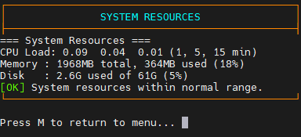
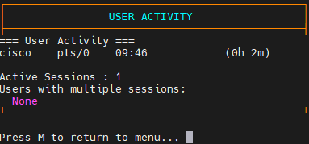
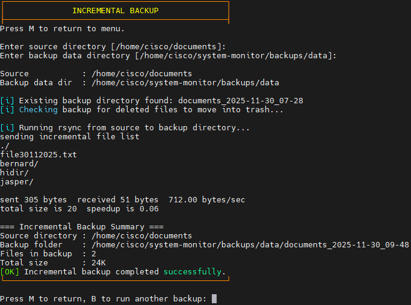
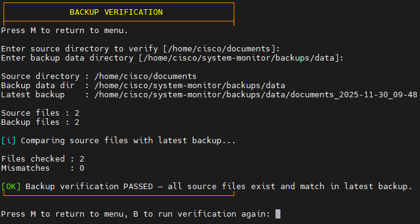
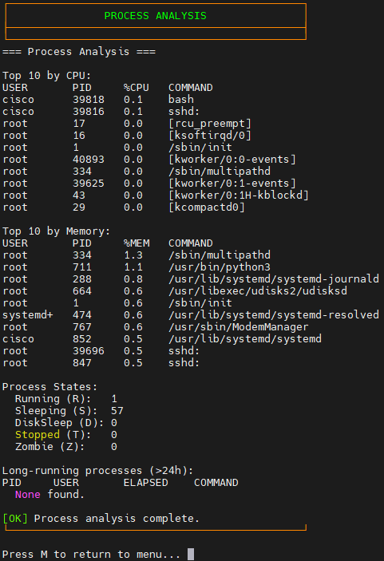

# SysSnapshot  
*A Modular Linux System Monitoring & Backup Utility*


SysSnapshot is a modular Bash-based toolkit designed to monitor system health, track user activity, perform incremental backups, verify backup integrity, generate filesystem usage reports, and analyse running processes.

This project was developed for **CIML019 – Software-Defined Infrastructure & Services (Assignment 1)**.

---

## 📌 Table of Contents

1. [Overview](#overview)  
2. [Project Structure](#project-structure)  
3. [Installation](#installation)  
4. [Features](#features)  
5. [Example Usage & Output](#example-usage--output)  
6. [Notes / Limitations](#notes--limitations)  
7. [Conclusion](#conclusion)

---

## Overview

SysSnapshot provides the following core functions:

- System resource monitoring  
- User session tracking with multi-session detection  
- Incremental backups using `rsync`  
- Trash-based deleted file retention  
- Backup integrity verification using content comparison  
- Filesystem usage reports  
- Process analysis (top CPU/memory + long-running detection)  
- Centralised logging with timestamps  
- Clean, colour-coded ASCII UI layout

All modules are stored under `/lib` for clarity and maintainability.

---
## 📁 Project Structure

```
system-monitor/
├── monitor.sh                  # Main launcher & menu controller
│
├── lib/                        # Functional modules
│   ├── ui.sh                   # UI helpers (boxes, colours, formatting)
│   ├── resources.sh            # CPU, RAM, disk monitoring
│   ├── users.sh                # User session tracking
│   ├── backup.sh               # Incremental backup + trash + verification
│   ├── filesystem.sh           # Filesystem usage analysis
│   └── process.sh              # Process monitoring (CPU/MEM/ETIME)
│
├── config/
│   └── settings.conf           # Configuration overrides
│
├── backups/
│   ├── data/                   # Timestamped backups
│   └── trash/                  # Deleted files with timestamps
│
├── logs/
│   └── system_monitor.log      # Centralised log file
│
├── reports/                    # Filesystem usage reports (.txt)
├── screenshots/                # Screenshot images used in README
├── tests/                      # Test scripts & outputs
└── README.md                   # Documentation
```
## ⚙️ Installation

### 1. Clone the project

```bash
git clone https://github.com/oligokz/system-monitor.git
cd system-monitor
```

### 2. Make the main script executable

```bash
chmod +x monitor.sh
```

### 3. Install dependencies (recommended)

```bash
sudo apt install rsync procps coreutils
```

All required directories (`backups`, `logs`, `reports`) are created automatically on first run.
## 🚀 Features

### 1. System Resource Monitoring (`check_system_resources`)
Displays:
- CPU load (1/5/15 min)
- Memory usage (GB + %)
- Disk usage of `/`
- Threshold warnings



---

### 2. User Activity Tracking (`track_user_activity`)
Displays:
- Logged-in users
- Terminal type (pts/tty)
- Login duration
- Multi-session detection



---

### 3. Incremental Backup (`create_incremental_backup`)
Features:
- `rsync -av` incremental syncing  
- Trash retention of deleted files  
- Timestamped backup folders  
- Smart detection of missing files  

  


---

### 4. Backup Integrity Verification (`verify_backup_integrity`)
Performs:
- File presence comparison  
- File counts  
- Content matching via `cmp -s`  

  


---

### 5. Filesystem Usage Report (`generate_filesystem_report`)
Includes:
- Top 10 largest directories  
- Directory with most files  
- Filesystem type summary  
- Disk usage overview  


---

### 6. Process Analysis (`analyze_running_processes`)
Displays:
- Top CPU processes  
- Top memory processes  
- Process states summary  
- Detection of processes running > 24 hours  



---
## ⚠️ Notes / Limitations

- Filesystem report may run slowly on large paths.
- Trash folder may grow indefinitely; cleanup is manual.
- Backup verification may fail if files change during scanning.
- Symlink or device file behaviour may vary.
- No automatic cleanup of old logs or backups.
- Log file resets on each run (`logging.sh` behaviour).

---
