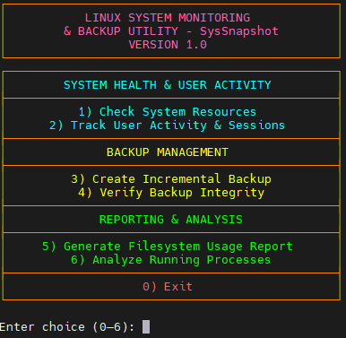

# SysSnapshot — Linux System Monitoring & Backup Utility

**Author:** Bernard Lim  
**Module:** CIML019 – Software-Defined Infrastructure & Services  

SysSnapshot is a modular Bash-based toolkit designed to provide essential system monitoring and safe incremental backups on Linux systems.  
It offers a structured menu-driven interface, detailed resource insights, backup verification, and filesystem analytics — all without installing heavy external packages.

---

## 📁 Project Structure

```
system-monitor/
│── monitor.sh                # Main script & menu
│── lib/                      # Feature modules
│   ├── ui.sh
│   ├── logging.sh
│   ├── resources.sh
│   ├── users.sh
│   ├── backup.sh
│   ├── filesystem.sh
│   └── process.sh
│── backups/                  # Backup + Trash system
│── logs/                     # Log output
│── reports/                  # Filesystem analysis reports
│── config/settings.conf      # Default settings
│── screenshots/              # Images used in this README
└── README.md
```

---

## ⚙️ Installation

Clone the repository:

```bash
git clone https://github.com/oligokz/system-monitor.git
cd system-monitor
```

Make the main script executable:

```bash
chmod +x monitor.sh
```

Run the tool:

```bash
./monitor.sh
```

---

## 🚀 Features

### 🔹 System Health Monitoring  
Check CPU load, RAM usage, disk consumption, and receive OK/WARN/ERR status indicators.

### 🔹 User Activity Tracking  
View who is logged in, session duration, and detect multiple sessions.

### 🔹 Incremental Backup System  
Safely back up files with automatic trashing of deleted items — no silent overwrite or loss.

### 🔹 Backup Integrity Verification  
Detect missing, edited, or mismatched files between source and backup.

### 🔹 Filesystem Usage Reporting  
Analyze directory sizes, largest folders, most populated paths, and filesystem type usage.

### 🔹 Process Analysis  
Identify top CPU/memory consumers, process states, and long-running jobs.

---

# 🧪 Example Usage & Output  
Below are the actual outputs from SysSnapshot, showing its capabilities in action.

---

## 🟦 1. Main Menu  
The central navigation hub showing all available system utilities.



---

## 🟦 2. System Resources (Option 1)  
Displays CPU load averages, memory usage, and disk usage, along with health status.


---

## 🟦 3. User Activity & Sessions (Option 2)  
Shows logged-in users, timestamps, session durations, and multi-session detection.


---

## 🟦 4. Incremental Backup – Start Prompt (Option 3)  
User is prompted for the source directory and the backup location.


---

## 🟦 5. Incremental Backup – Successful Backup  
Shows rsync activity, deleted file handling, and backup summary including file count and size.


---

## 🟦 6. Backup Verification – PASS (Option 4)  
All files match between source and the most recent backup.


---

## 🟦 7. Deleted File in Trash  
SysSnapshot safely moves deleted items into timestamped trash directories instead of discarding them.


---

## 🟦 8. Backup Verification – FAIL  
The system detects missing files and lists exactly which ones differ.


---

## 🟦 9. Filesystem Report (Option 5)  
A complete analysis including directory sizes, filesystem types, and most populated folders.


---

## 🟦 10. Process Analysis (Option 6)  
Shows top 10 CPU processes, top 10 memory users, process states, and long-running processes.


---

# 📝 Notes

- Scripts use only standard Linux tools (`ps`, `du`, `find`, `rsync`, etc.).  
- Designed for Ubuntu/Debian-based systems but should work on most Linux distributions.  
- All functions are modular, easy to extend, and well-commented for learning purposes.

---

# 🎯 Conclusion

SysSnapshot successfully meets the requirements of the CIML019 assignment by delivering a robust, modular, and user-friendly system monitoring toolkit.  
Its incremental backup with a trash mechanism, detailed filesystem analysis, and clear UI make it both practical and educational — ideal for environments where lightweight, transparent tools are preferred.

